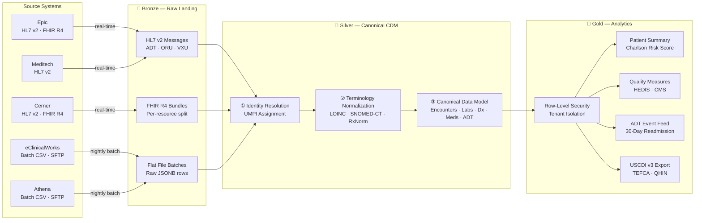
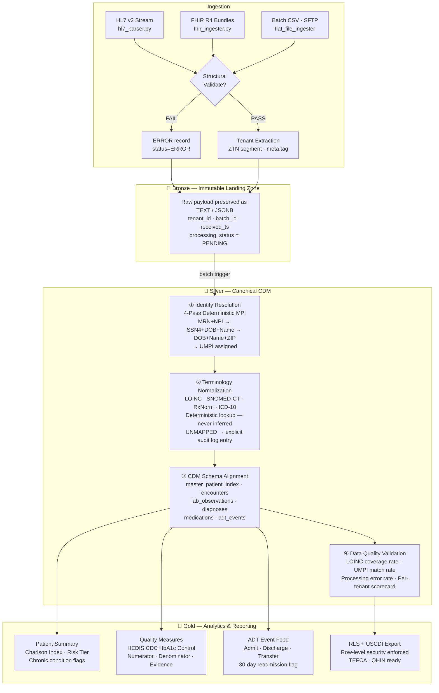

# fhir-data-pipeline

A vendor-agnostic reference architecture for multi-tenant clinical data normalization at state HIE scale — demonstrating canonical data model design, HL7 v2/FHIR R4 ingestion, deterministic identity resolution, medallion architecture, and USCDI v3 alignment.

Built entirely on synthetic data. No real patient data exists anywhere in this repository.

---

## The Problem

Healthcare data arrives in two flavors, and neither is clean.

The first is real-time HL7 v2 and FHIR R4 — ADT event streams, lab results, clinical summaries from EHRs like Epic and Cerner. Structured, but inconsistent: local code systems, mismatched terminology, and patient identifiers that mean something inside one organization and nothing outside it. I encountered this directly normalizing Epic ADT and ORU feeds onto Cerner's HealtheIntent platform at IU Health. The interface engine handles transport. The hard problem is what happens after the message lands: resolving "MRN-29471 at INTEGRIS_BAPTIST" to the same patient record as "MRN-84201 at St. Francis," and mapping "HgbA1c" from one tenant to the same LOINC code as "A1c" from another.

The second is the batch flat file — a CSV dropped on an SFTP server at midnight by a vendor whose API roadmap is perpetually "coming soon." This is not a legacy edge case. At Intermountain Health, I worked with eClinicalWorks data arriving as a daily CSV dump into SQL Server. A significant portion of the ambulatory market still operates this way, and any HIE architecture that ignores this path will have gaps in participating provider coverage from day one.

A state-scale Health Data Utility has to handle both paths, normalize both into a single coherent clinical record, resolve patient identity across organizational boundaries, and serve that data to multiple tenants who cannot see each other's records. This repository is a working proof of concept for that architecture.

---

## Architecture

### High-Level Data Flow



> Full-resolution diagram: [`docs/architecture-overview.svg`](docs/architecture-overview.svg)

---

### Detailed Processing Workflow



> Full-resolution diagram: [`docs/workflow-detail.svg`](docs/workflow-detail.svg)

---

## Walk-Through: One Patient Through the Full Pipeline

The synthetic patient in this repo is Carlos Ramirez, 49, presenting to INTEGRIS Baptist Medical Center with an AMI, Type 2 diabetes, and hypertension. Running `python run_pipeline.py` executes all five stages against this scenario and shows exactly what the pipeline does with his data.

**Stage 1 — HL7 v2 Ingestion (Bronze):** The ADT^A01 admission message arrives from Epic. The parser extracts the tenant identifier from the custom ZTN segment (`TENANT_ID=INTEGRIS_BAPTIST`), captures envelope metadata from MSH, and lands the full 1,827-character raw payload untouched in Bronze. `processing_status=PENDING`. Nothing clinical has been touched.

**Stage 2 — FHIR R4 Ingestion (Bronze):** A FHIR R4 transaction Bundle arrives with four resources: Patient, Encounter, Observation, and Condition. The ingester splits it into four Bronze rows — one per resource, not one per Bundle. The full Bundle JSON attaches to the Patient row for audit. The three subsequent rows carry only their own resource payload. This matters at scale: Observation and Condition have different normalization cadences and different downstream consumers.

**Stage 3 — Identity Resolution (Silver):** Carlos Ramirez's Patient resource enters the MPI. No prior record exists — a new UMPI is minted (`NEW_RECORD`, `match_confidence=0.0`). When the same identity resolves a second time — as it would when a second feed arrives from the same source — it returns the identical UMPI via Pass 2 (identifier system + value). `match_method=DETERMINISTIC`. The consistency guarantee holds.

If Carlos had also been seen at St. Francis with a different MRN, that second identity would resolve via Pass 3 (SSN4 + DOB + family name) and return the same UMPI. That is the cross-organizational identity linkage that makes a multi-tenant HIE clinically coherent.

**Stage 4 — Bronze → Silver Normalization:** The HbA1c Observation carries LOINC 4548-4 from the Epic source system — `loinc_map_method=SOURCE_LOINC`. The source display "HgbA1c" is preserved alongside the canonical display "Hemoglobin A1c/Hemoglobin.total in Blood." One normalization log entry is written. If the source had sent `"A1c"` with no code system — the eClinicalWorks CSV scenario — the terminology service would have mapped it via display text to the same LOINC code with `loinc_map_method=TERMINOLOGY_SERVICE`. Unmapped codes produce `UNMAPPED` log entries and Silver records with `loinc_mapped=False`. Nothing is dropped silently.

**Stage 5 — Silver → Gold Analytics:** Carlos's three diagnoses score a Charlson Comorbidity Index of 2 (AMI + T2DM), placing him in the `MODERATE` risk tier. His HbA1c of 8.2% places him in the CDC HbA1c Control measure denominator (age 18-75, confirmed diabetes) but fails the `<8.0%` threshold — `numerator=False`. In a provider's HEDIS report, this counts against their diabetes control rate. The evidence date and value are stored for audit. The ADT event feed records the A01 admission and A03 discharge with `is_readmission_30d=False`.

---

## Design Decisions

**Bronze is sacred.** Raw data lands immutably — no transforms, no rejections. This creates a legal audit trail of exactly what each source system sent and enables Silver reprocessing when standards change without re-pulling from source. If a LOINC mapping table is corrected next quarter, Bronze replays. The source data is always there.

**Identity resolution before clinical normalization.** You cannot normalize clinical data across tenants until you know you're talking about the same patient. The MPI runs first, assigns a UMPI, and every downstream Silver entity is keyed to it. Running normalization before identity resolution produces a Silver layer where the same patient exists as multiple disconnected records — one per source MRN. That is not a HIE. It is a federated directory.

**Terminology mapping is deterministic, not inferred.** LOINC, SNOMED-CT, and RxNorm mappings are table lookups from authoritative releases. "HgbA1c" and "A1c" and "Hemoglobin A1c" all map to LOINC 4548-4 because they are in the same lookup table. Every mapping is logged with source value, mapped value, confidence score, and mapping method. Unmapped codes produce explicit `UNMAPPED` records. LLMs belong in this architecture — but for extracting structured data from unstructured clinical text, not for resolving codes that have authoritative answers.

**Tenant isolation at the platform level.** Row-level security on Gold tables enforces that Hospital A cannot see Hospital B's records. This is enforced at the database layer (Snowflake RLS, Databricks Unity Catalog), not in application code where it can be bypassed. HDU operators get cross-tenant aggregate views where data sharing agreements permit.

**Vendor agnostic by design.** SQL is ANSI standard with Snowflake and Databricks/Delta Lake variant callouts in comments. Python dependencies are `hl7apy` and `fhir.resources`. No proprietary SDK lock-in. The target platform is a design decision for the organization deploying this, not for the architecture.

---

## Repository Structure

```
fhir-data-pipeline/
├── .github/workflows/
│   ├── ci.yml                        # CI: tests + pipeline on push/PR (Python 3.11 + 3.12)
│   └── regenerate-results.yml        # Auto-regenerates PIPELINE_RESULTS.md on main
├── data/synthetic/
│   ├── hl7_adt_sample.txt            # Synthetic ADT^A01 admission message
│   ├── hl7_oru_sample.txt            # Synthetic ORU^R01 lab results
│   └── fhir_bundle_sample.json       # Synthetic FHIR R4 Bundle (Patient/Encounter/Obs/Condition)
├── docs/
│   ├── architecture-overview.svg     # High-level architecture diagram
│   ├── workflow-detail.svg           # Detailed processing workflow diagram
│   ├── architecture.md               # Full design rationale
│   ├── canonical-data-model.md       # CDM entity definitions and USCDI coverage
│   ├── tenant-isolation.md           # Multi-tenancy patterns and RLS implementation
│   └── uscdi-alignment.md            # USCDI v3 data class mapping
├── ingestion/
│   ├── hl7_parser.py                 # HL7 v2 → Bronze (MSH + ZTN extraction)
│   └── fhir_ingester.py              # FHIR R4 Bundle → Bronze (per-resource split)
├── schema/
│   ├── bronze.sql                    # Raw landing tables
│   ├── silver.sql                    # Canonical CDM schema
│   └── gold.sql                      # Analytics tables + RLS policies
├── transforms/
│   ├── identity_resolution.py        # Deterministic MPI → UMPI assignment
│   ├── bronze_to_silver.py           # Normalization: LOINC, RxNorm, SNOMED
│   └── silver_to_gold.py             # Risk scoring, quality measures, ADT feed
├── tests/
│   └── test_transforms.py            # 41 unit tests (pytest)
├── Makefile                          # Convenience commands
├── PIPELINE_RESULTS.md               # Auto-generated pipeline run output
├── README.md
└── run_pipeline.py                   # End-to-end runner
```

---

## Running Locally

```bash
# Install dependencies
pip install hl7apy fhir.resources pytest

# Run full pipeline — all 5 stages + 41 tests — regenerates PIPELINE_RESULTS.md
python run_pipeline.py

# Or via Makefile
make install
make run

# Tests only
make test
```

**No cloud credentials, no database connection, no environment configuration required.** All stages run against the synthetic data in `data/synthetic/`.

See [`PIPELINE_RESULTS.md`](PIPELINE_RESULTS.md) for the most recent run output with annotated stage-by-stage results.

---

## CI/CD

Two GitHub Actions workflows run automatically:

| Workflow | Trigger | What it does |
|---|---|---|
| `ci.yml` | Push to `main`/`develop`, PRs | Runs 41 tests + full pipeline on Python 3.11 and 3.12 |
| `regenerate-results.yml` | Push to `main` (pipeline files changed) | Regenerates and commits `PIPELINE_RESULTS.md` |

---

## Stack

| Component | Technology |
|---|---|
| Language | Python 3.11+ |
| SQL | ANSI SQL (Snowflake / Databricks Delta Lake variants noted) |
| HL7 parsing | `hl7apy` |
| FHIR parsing | `fhir.resources` |
| Testing | `pytest` — 41 unit tests |
| CI/CD | GitHub Actions |
| Target platform | Vendor-agnostic (Databricks, Snowflake, or Postgres for local dev) |

---

## About

This reference architecture reflects patterns I've worked with directly across 15+ years in healthcare data engineering — normalizing Epic feeds onto Cerner's HealtheIntent platform at IU Health, integrating eClinicalWorks flat-file exports at Intermountain Health, and building population health analytics pipelines at Anthem. The dual ingestion path (real-time HL7/FHIR + nightly CSV) is not a design choice. It is the operational reality of every state HIE participating provider network.

**Phillip Johnson** · Healthcare Data Architect · [informatiq.ai](https://informatiq.ai)

MSHI · MBA · 15+ years across VA, IU Health, Anthem, Intermountain Health, CVS
